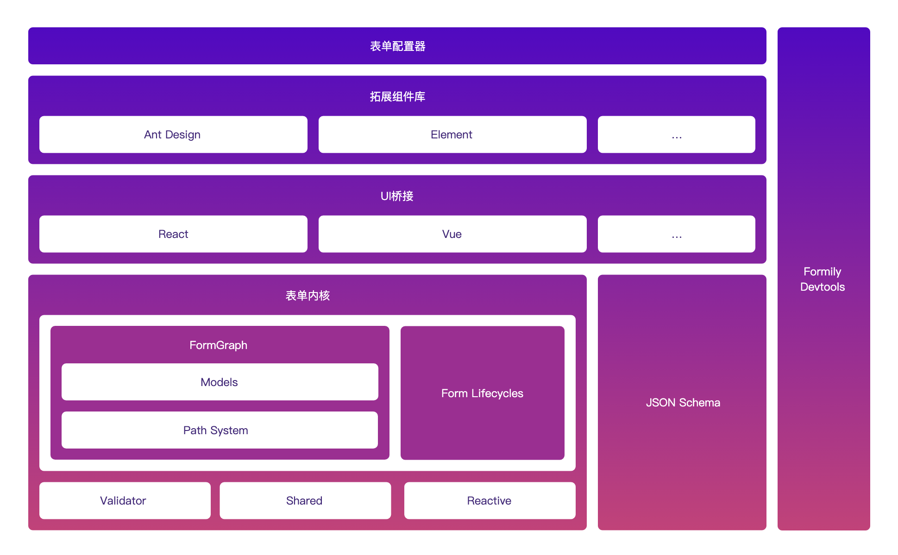

# 解读 formily 源码

非深度使用用户，仅按照当前理解可能存在偏差，后续会持续补充

## 相关文档

- <https://github.com/alibaba/formily>

## 前言

为什么要对 from 表单做如此封装，复杂点在哪？

假如说当前有这样的一个场景，在服务端监控报警中，往往需要提供不同的指标监控类型，不同的监控指标对应着不同的服务列表，不同的服务列表又关联着相应的细分指标，在 jvm 运行时监控配置中，需要选择相应的监控指标，语言类型，根据语言类型提供不同的服务列表，勾选不同的服务对应着不同的细化指标，然而这些信息都会展示在一个表单页面中，如果使用传统的表单使用 JSX 实现这个功能会产生庞大的jsx内容以及相应的判断条件，并且在面临字段与字段之间的联动逻辑时往往需要手动添加一层父级组件和元数据来维护他们之间关系，一定程度上影响了组件的可阅读性和可维护性，一旦需要新增或者删除某个字段，往往会牵扯很多原有逻辑的改动。

引用 formily 文档所描述，业务场景中针对 form 表单会暴露出以下问题：

- 字段数量繁多
  - 一对多
  - 多对一
  - 多对多
- 表单数据管理复杂
  - 表单转换逻辑复杂
  - 同步默认与异步值合并问题
  - 夸表单数据的通信
- 表单状态管理复杂
- 表单的场景化复用
  - 查询列表
  - 弹窗
  - 分步表单
  - 选项卡
- 动态渲染

这都是数据中后台场景中经常碰到的问题，面对如此复杂的表单场景如何才能更好的去组织管理，formily 对此作了很多的探索

这里简单介绍一下 formily 的处理方案，看一下 formily 是如何解决以上问题的

## formily 的架构



formily 相对于其他 form 表单类库的特点官网也已经有所说明，在支持更多的复杂场景下还拥有者较高的性能， 通过 reactive 响应式编程思想解决了整个表单组件重新渲染的问题，主要核心内容主要在：

- formily/reactiv
  - 响应式实现，负责依赖的收集，是 formily 核心机制之一，通过 Proxy 实现对filed 数据的监听拦截，副作用处理，在字段更新校验时，能够精确的定位到对应位置和相关依赖的处理
  
- formily/core
  - core 是 formily 整个架构中的 VM 层，用于处理 Form Field 等模型，是 formily 的核心， 囊括了 Form -> Field Tree 之间的更新数据通信

## formily/reactive

这玩意类似 vue reactive watch 部分的作用，用于响应式，同样也是使用 Proxy 去监听属性变化， 这部分先不做详细介绍。。。。

## formily/core

### Form 实例

- Form 是 fromily 的状态管理中心，可以理解为基于表单组件层之上的父级组件，用来维护表单内部组件和状态

```TypeScript
const createForm = <T extends object = any>(options?: IFormProps<T>) => {
  // 新建Form实例
  return new Form(options)
}
// form 实例上的属性和方法
export class Form<ValueType extends object = any> {
  // Form实例上的属性
  displayName = 'Form'
  id: string
  initialized: boolean
  validating: boolean
  submitting: boolean
  loading: boolean
  modified: boolean
  pattern: FormPatternTypes
  display: FormDisplayTypes
  values: ValueType
  initialValues: ValueType
  mounted: boolean
  unmounted: boolean
  props: IFormProps<ValueType>
  heart: Heart
  // 这个其实就是负责依赖关系追踪、循环依赖的检测等
  graph: Graph
  // 映射
  fields: IFormFields = {}
  requests: IFormRequests = {}
  // path与address的映射
  indexes: Record<string, string> = {}
  // 卸载回调
  disposers: (() => void)[] = []

  constructor(props: IFormProps<ValueType>) {
    // 初始化属性
    this.initialize(props)
    // 为属性赋予响应式特性
    this.makeObservable()
    // 监听字段触发生命周期事件
    this.makeReactive()
    // 赋予values和initialValues的初始值
    this.makeValues()
    // 触发onInit相关生命周期事件
    this.onInit()
  }
  
    protected initialize(props: IFormProps<ValueType>) {
    this.id = uid()
    this.props = { ...props }
    this.initialized = false
    this.submitting = false
    this.validating = false
    this.loading = false
    this.modified = false
    this.mounted = false
    this.unmounted = false
    this.display = this.props.display || 'visible'
    this.pattern = this.props.pattern || 'editable'
    this.editable = this.props.editable
    this.disabled = this.props.disabled
    this.readOnly = this.props.readOnly
    this.readPretty = this.props.readPretty
    this.visible = this.props.visible
    this.hidden = this.props.hidden
    this.graph = new Graph(this)
    // 管理生命周期
    this.heart = new Heart({
      lifecycles: this.lifecycles,
      context: this,
    })
  }

  // 用于获取初始值
  protected makeValues() {
    this.values = getValidFormValues(this.props.values)
    this.initialValues = getValidFormValues(this.props.initialValues)
  }
  
  // 用于为属性赋予响应式
  protected makeObservable() {
    define(this, {
      fields: observable.shallow,
      indexes: observable.shallow,
      initialized: observable.ref,
      validating: observable.ref,
      submitting: observable.ref,
      loading: observable.ref,
      modified: observable.ref,
      pattern: observable.ref,
      display: observable.ref,
      mounted: observable.ref,
      unmounted: observable.ref,
      values: observable,
      initialValues: observable,
      valid: observable.computed,
      invalid: observable.computed,
      errors: observable.computed,
      warnings: observable.computed,
      successes: observable.computed,
      hidden: observable.computed,
      visible: observable.computed,
      editable: observable.computed,
      readOnly: observable.computed,
      readPretty: observable.computed,
      disabled: observable.computed,
      setValues: action,
      setValuesIn: action,
      setInitialValues: action,
      setInitialValuesIn: action,
      setPattern: action,
      setDisplay: action,
      setState: action,
      deleteInitialValuesIn: action,
      deleteValuesIn: action,
      setSubmitting: action,
      setValidating: action,
      reset: action,
      submit: action,
      validate: action,
      onMount: batch,
      onUnmount: batch,
      onInit: batch,
    })
  }
  
  // 用于监听字段变化触发生命周期事件
  protected makeReactive() {
    this.disposers.push(
      observe(
        this,
        (change) => {
          triggerFormInitialValuesChange(this, change)
          triggerFormValuesChange(this, change)
        },
        true
      )
    )
  }
  
  onInit = () => {
    this.initialized = true
    this.notify(LifeCycleTypes.ON_FORM_INIT)
  }
  // ...
  }

```

- Form 实例构造函数初始化
  - 构造函数中通过 initialize 方法初始化 Form 模型涉及的字段，依据传入的 props 为 Form 设定初始值
- makeObservable
  - makeObservable能使被定义的属性获得响应式能力，像values、visible等属性在初始化时就具备了这种能力。这里values属性的劫持方式是深劫持，此部分和reactive相关内容有联系，但暂不详细阐述。
- makeValues
  - makeValues函数负责从props中获取values和initialValues并赋予初始值。
- makeReactive
  - makeReactive函数是一种消息订阅发布机制。
  - 它会对字段值的变化进行监听，当字段值改变时，会触发Form上的ON_FORM_VALUES_CHANGE和ON_FORM_INITIAL_VALUES_CHANGE这两个生命周期。需要注意的是，它本身不是响应式的，但可能因响应式的副作用而触发，比如字段值变化后通知Form触发相应事件。
  - 生命周期事件通过notify函数将动作告知Form，以执行对应生命周期的回调函数。例如，构造函数最后调用的onInit，就是通过notify通知Form执行与ON_FORM_INIT事件相关的回调函数。

### 生命周期

```TypeScript
 // 用来添加外部副作用
 addEffects = (id: any, effects: IFormProps['effects']) => {
    if (!this.heart.hasLifeCycles(id)) {
      this.heart.addLifeCycles(id, runEffects(this, effects))
    }
  }
 // 清除外部副作用
 removeEffects = (id: any) => {
    this.heart.removeLifeCycles(id)
  }
// 设置内部副作用
  setEffects = (effects: IFormProps['effects']) => {
    this.heart.setLifeCycles(runEffects(this, effects))
 }
 
// Heart
 lifecycles: LifeCycle<Payload>[] = []

 outerLifecycles: Map<any, LifeCycle<Payload>[]> = new Map()
 
 hasLifeCycles = (id: any) => {
 // 针对外部生命周期
    return this.outerLifecycles.has(id)
  }
  
 addLifeCycles = (id: any, lifecycles: LifeCycle[] = []) => {
    const observers = this.buildLifeCycles(lifecycles)
    if (observers.length) {
    // 针对外部生命周期
      this.outerLifecycles.set(id, observers)
    }
  }
  
 buildLifeCycles = (lifecycles: LifeCycle[]) => {
    return lifecycles.reduce((buf, item) => {
      if (item instanceof LifeCycle) {
        return buf.concat(item)
      } else {
        if (isArr(item)) {
        // 对内层做处理并返回内层
          return this.buildLifeCycles(item)
        } else if (typeof item === 'object') {
         // 有可能传入context
          this.context = item
          return buf
        }
        return buf
      }
    }, [])
  }
 
 removeLifeCycles = (id: any) => {
 // 针对外部生命周期
    this.outerLifecycles.delete(id)
  }

 setLifeCycles = (lifecycles: LifeCycle[] = []) => {
 // 针对内部生命周期
    this.lifecycles = this.buildLifeCycles(lifecycles)
  }
 
 publish = <P, C>(type: any, payload?: P, context?: C) => {
     // type就是生命周期类型
    if (isStr(type)) {
    // 通知内部生命周期看看，有没有对应上类型的，如果有就执行回调
      this.lifecycles.forEach((lifecycle) => {
        lifecycle.notify(type, payload, context || this.context)
      })
       // 通知外部生命周期看看，有没有对应上类型的，如果有就执行回调
      this.outerLifecycles.forEach((lifecycles) => {
        lifecycles.forEach((lifecycle) => {
          lifecycle.notify(type, payload, context || this.context)
        })
      })
      // 通知Heart自身的订阅者执行对应事件的回调
      this.notify({
        type,
        payload,
      })
    }
  }
```

1. 内外部生命周期的区分
   - 内部生命周期由effects配置中的effect钩子生成，其他情况生成外部生命周期，二者是分离的。

2. buildLifeCycle 函数的作用
   - 处理传入的生命周期数组（可能包含context对象和内层数组），最终生成一个扁平 的生命周期数组。

3. addEffects 函数的功能和应用场景
   - 将传入的副作用函数执行生成的生命周期函数加入外部生命周期。
   - 应用场景包括：Field 实例初始化时执行reactions中的effect钩子生成生命周期（此时id为对应的 Field 实例）；使用useFormEffect钩子向自定义组件注入副作用逻辑。

4. removeEffects 函数的作用
   - 用于清除对应id的外部生命周期（副作用）。

5. setEffects 函数的作用
   - 针对内部生命周期（副作用）进行操作。
  
6. 生命周期的作用与 publish 函数
   - 内外部生命周期的作用是联通生命周期事件和相关回调。
   - Heart 是消息发布订阅机制的中间层，触发生命周期事件时调用publish函数，遍历 Form 实例的内外部生命周期，执行对应类型生命周期事件的回调函数（notify实际上就是publish函数）。
  
7. 生命周期相关函数的意义和所在文件
   - 这些函数构成 Form 的任务调度中心，相关源码在Heart.ts文件中，每个Form都有一个Heart实例。

### 生命周期与发布订阅

### runEffects

```TypeScript
export const runEffects = <Context>(
  context?: Context,
  ...args: ((context: Context) => void)[]
): LifeCycle[] => {

  // globalState 初始化
  GlobalState.lifecycles = []
  GlobalState.context = []
  GlobalState.effectStart = true
  GlobalState.effectEnd = false
  // 上下文是当前Form实例
  if (isForm(context)) {
    FormEffectContext.provide(context)
  }

  args.forEach((effects) => {
    if (isFn(effects)) {
      effects(context)
    }
  })
  // effects标记， 更新状态
  GlobalState.context = []
  GlobalState.effectStart = false
  GlobalState.effectEnd = true
  // 将lifecycles返回
  return GlobalState.lifecycles
}
```

从这部分代码来看， 每次执行 runEffets 都会重新收集生命周期，执行完收集的回调之后更新了几个状态，这从侧面说明 lifecycles 应该是在定义effect函数时产生的

TODO：待研究

## Field&路径系统

因为我们实际业务的表单结构本身就是一个树结构，所以在 Formily 中，每个字段在表单模型中都会有一个绝对路径，这个绝对路径大致描述了字段在表单数据中的位置(为什么用大致，后面会讲)，通过绝对路径可以找到任意一个字段，同时还能表达字段间的父子关系，所以字段模型中，我们定义了 address 属性来表达字段的绝对路径，主要用点语法来描述，比如 a.b.c 这样的路径代表了字段 c 的父亲是字段 b，字段 b 的父亲是 a。
当然，事情并没有这么简单，因为我们还有 VoidField，VoidField 作为虚数据字段，它同样也有自己的绝对路径，因为它可以作为数据字段的父亲，如果我们只有绝对路径， 就无法让一个数据字段正确的往表单数据里写入字段数据。读取数据也会读错位置。

## 表单的校验&feedback

### Field 获取selfErrors 流程

### Field 更新 setErrors 流程

### Form Field 获取 errors 流程

### 校验流程
